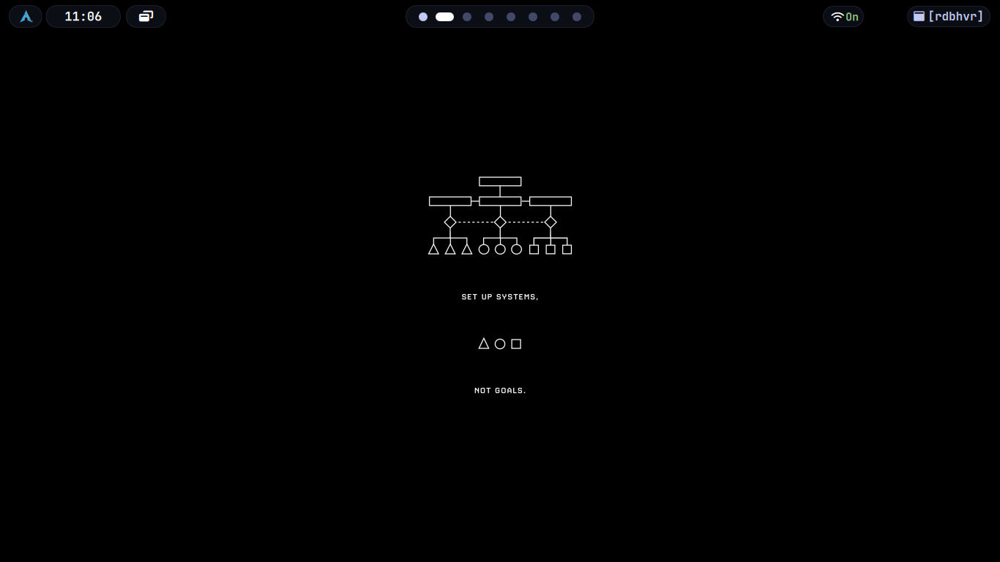

## What is Bspwm?

At its core, **bspwm** is a *tiling window manager* that represents windows as the leaves of a full binary tree. This description, while accurate, conceals the profound implications of that choice. 

> [!IMPORTANT]
To understand bspwm is to understand that it is not a window manager that happens to use a tree data structure for implementation convenience. Rather, it is a system where the tree *is* the fundamental reality, and everything you see on screen is merely a visual projection of that tree's current state.

When bspwm starts, it creates an *empty canvas.* This canvas is divided into monitors, each monitor contains desktops, and each desktop holds a pointer to a binary tree. The tree begins empty. As windows arrive, they **become leaves in this tree**, and the tree grows according to principles **that are mathematical and deterministic rather than aesthetic or heuristic.** The tree does not care about your visual preferences. It does not optimize for beauty. It grows according to splitting logic, and the windows you see arranged on screen are the inevitable consequence of that tree's structure.

This is the first and **most important conceptual shift** required to understand bspwm: the window layout is not designed. It is emergent. You are not arranging windows in space. You are building a tree, and space arrangement is what happens when that tree is rendered.

## Binary Space Partitioning as Foundation 

> [!NOTE]
> **Definition**
Binary space partitioning is a technique borrowed from computer graphics and spatial databases. The fundamental operation is simple: take a region of space and divide it into exactly two sub-regions. Then take those sub-regions and divide each of them into two more sub-regions. Continue recursively. The result is a hierarchical subdivision of space where every split creates exactly two children, and every window occupies one undivided leaf region.

In bspwm, this manifests as follows. When the first window appears on an empty desktop, **it occupies the entire available rectangle.** (See figure 1.1) The tree is a single leaf node. When a second window arrives, bspwm must make a decision: should this space be split horizontally or vertically, and should the new window become the first child or the second child of the split? **This decision is controlled by the automatic insertion scheme, which can be set to longest side, alternate, or spiral.**

**Figure 1.1 :** *In the above given figure, there are two windows open : quickshell, another is the desktop itself. Here I used feh to fill the background, which itself acts as a seperate window.*

The **longest side scheme** examines the dimensions of the focused window's tiling rectangle and splits along whichever axis is longer. If width exceeds height, the split is vertical, dividing left and right. If height exceeds width, the split is horizontal, dividing top and bottom. This creates a visual effect where windows tend toward squareness because each split reduces the dominant dimension.

The **alternate scheme** ignores geometry entirely and alternates splitting direction with each new window. First split is vertical, second is horizontal, third is vertical, and so on. This produces a regular grid-like pattern when windows are added in sequence.

The **spiral scheme**, which is often the default, generates a clockwise or counter-clockwise spiral pattern depending on whether each new window becomes the first or second child of its parent. This scheme creates what resembles a **Fibonacci-like layout** where windows wrap around the perimeter of the tree. 

> [!NOTE]
But these schemes are **not layouts in the traditional sense.**  
They **are tree construction algorithms.** The layout you see is what happens when you render a tree that was built using a particular insertion rule. This distinction becomes critical when you try to modify the tree later, because bspwm provides no operation to "change the layout." You can only modify the tree structure itself—rotate it, flip it, change split ratios, or manually rearrange nodes—and the visual layout changes as a consequence.

