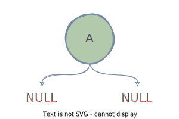
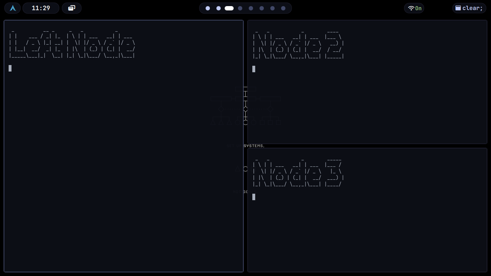

## The Tree as Living State

A binary tree in bspwm consists of **two types of nodes: internal nodes and leaf nodes.** *Internal nodes represent splits.* They contain no windows. Their only purpose is to divide a rectangle into two smaller rectangles by storing a splitting type (horizontal or vertical) and a splitting ratio (a value between zero and one that determines how much of the parent rectangle goes to the first child versus the second child). (See figure 1.2)

**Figure 1.2:** *This is a representation of the root node A. It has two splits, i.e internal nodes having no windows. A is usually your screen with wallpaper.*

*Leaf nodes represent windows.* They sit at the bottom of the tree and hold references to actual X11 windows. When bspwm needs to display windows on screen, **it performs a tree traversal.** Starting from the root, it recursively subdivides the desktop rectangle according to each internal node's splitting parameters until it reaches the leaves, at which point it knows the exact geometry for each window.

This means that a **window's size and position are not properties of the window itself.** They are computed properties derived from the path taken through the tree to reach that window's leaf node. 

> [!IMPORTANT]
If you want to resize a window, you are not resizing the window. You are adjusting the split ratio of an internal node somewhere in the tree above that window, which then propagates down through the tree structure to change multiple windows' geometries simultaneously.

Consider three windows arranged in a tree where window one occupies the left half of the screen, and windows two and three are stacked vertically in the right half. The tree structure is an internal node at the root with a vertical split at ratio zero point five (See figure 1.3).The left child is a leaf containing window one. The right child is another internal node with a horizontal split at ratio zero point five, and that node's children are leaves containing windows two and three.

**Figure 1.3:** *Representation of 3 nodes in bspwm*

If you want to make window two larger, you cannot do this directly. **You must identify the internal node that splits between windows two and three, then adjust its ratio.** This internal node is the parent of both windows. Changing its ratio to, say, zero point seven means window two now receives seventy percent of the available height in the right half of the screen, and window three receives thirty percent. But notice that window one was completely unaffected, because that window is not a descendant of the node you modified.

> [!IMPORTANT]
**This tree-centric view explains behaviors that confuse new users.** If you try to resize a window and nothing happens, it is **because the focused window is an only child and has no sibling with which it shares a split.** If you resize a window and three other windows also change size, it is because you modified a split high in the tree that affects multiple descendants. If you move a window to a new position and its size changes unexpectedly, it is because that window now occupies a different leaf position in the tree, and leaf positions have geometries determined by their ancestral splits.

The tree is not an implementation detail. It is the model. Everything else follows from it. We will see more about this in schemes of bspwm.
